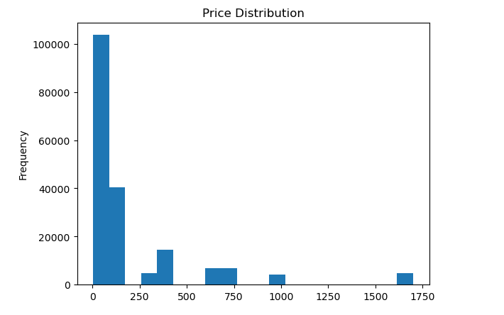

# sales-data-analysis
A simple Python project to analyze row counts, data type, info and summaries of sales data.
# Sales Data Analysis Project

## Description
This project performs a basic exploratory data analysis (EDA) on a sales dataset to understand volume and value ranges.

## Features
* **Row Counting:** Determines the total number of transactions recorded.
* **Min/Max Discovery:** Identifies the lowest and highest values in the dataset.
* **Summary Statistics:** Generates a quick overview of the data distribution.

## Tech Stack
* **Language:** Python
* **Library:** Pandas
* **Environment:** Jupyter Notebook

## How to Run
1. Clone this repo: `git clone https://github.com/YOUR_USERNAME/sales-data-analysis.git`
2. Ensure you have `pandas` installed: `pip install pandas`
3. Open `analysis.ipynb` in Jupyter or VS Code.
import pandas as pd

# Load the data
df = pd.read_csv('sales.csv')

# 1. Count rows
print(f"Total Rows: {len(df)}")

# 2. Find min/max (assuming a column named 'Price')
print(f"Min Value: {df['Price'].min()}")
print(f"Max Value: {df['Price'].max()}")

# 3. Print simple summaries
print(df.describe())
import pandas as pd
import matplotlib.pyplot as plt

# 1. Load Data
df = pd.read_csv('sales.csv')

# --- VISUALIZATION 1: Price Distribution (Histogram) ---
df['Price Each'].plot(kind='hist', bins=20, title='Price Distribution')
plt.show()
## 📊 Data Visualizations
Below are the key visual insights generated from the dataset:

### 1. Price Distribution

*This chart shows the concentration of sales prices and identifies outliers.*

